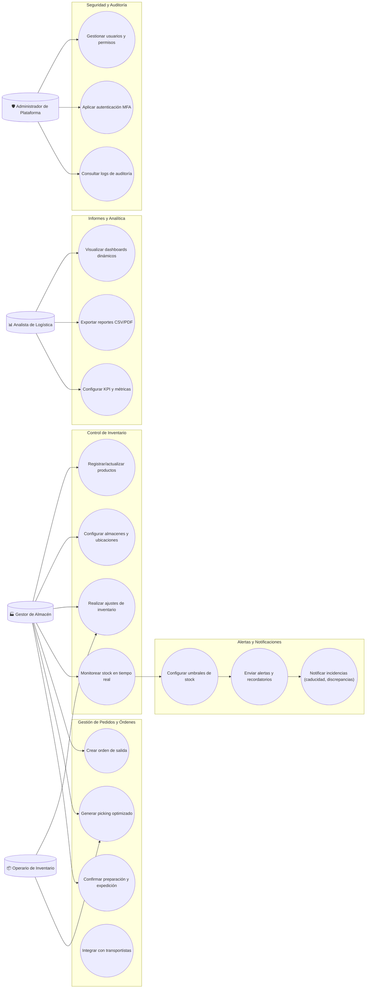
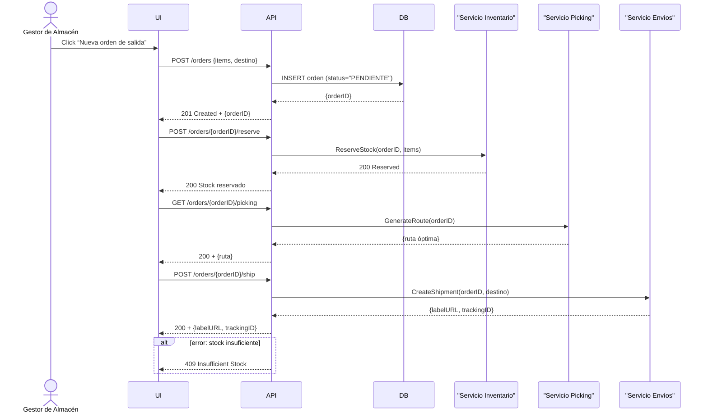
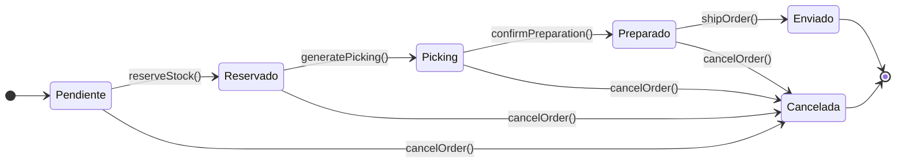
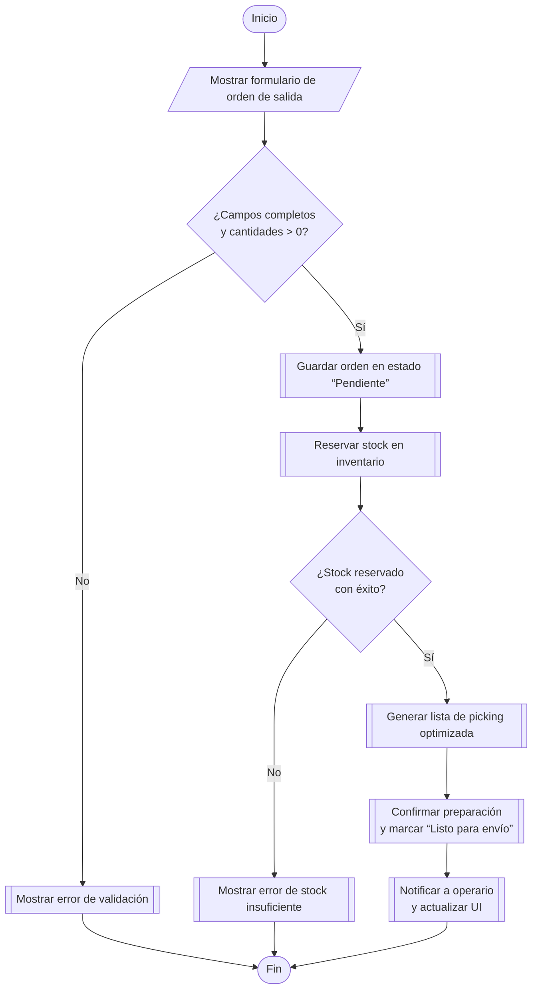

# Plataforma Web de Gestión Integral de Almacenes y Stock

**Descripción General:** 

Desarrollar una aplicación web modular y escalable destinada a la gestión completa de inventarios y almacenes para empresas de distribución y fabricación. El sistema permitirá planificar y supervisar flujos de entrada y salida de mercancías, controlar niveles de stock en tiempo real, optimizar la ubicación interna de productos, generar alarmas automáticas ante umbrales críticos y facilitar la preparación de pedidos y envíos. Además, proveerá análisis y reportes dinámicos para apoyar la toma de decisiones operativas y estratégicas.

**Principales Módulos y Funcionalidades:** 

1. **Control de Inventario** 

  - Registro y alta de productos con atributos (código, descripción, dimensiones, lote y caducidad). 

  - Gestión de múltiples almacenes y ubicaciones internas (pasillos, estantes, zonas de picking). 

  - Ajustes de inventario (recepciones, traslados internos, mermas, devoluciones). 

  - Niveles de stock en tiempo real y vistas históricas de movimientos.

2. **Gestión de Pedidos y Órdenes de Trabajo** 

  - Creación de órdenes de salida a clientes o producción. 

  - Generación de listados de picking con rutas optimizadas. 

  - Confirmación de preparación, embalaje y expedición. 

  - Integración con transportistas para etiquetas y seguimiento de envíos.

3. **Alertas y Notificaciones** 

  - Alertas automáticas por umbrales mínimos/máximos de stock. 

  - Notificaciones por correo o en la interfaz para recepciones tardías, discrepancias en inventario o artículos próximos a caducar. 

  - Recordatorios de recuentos cíclicos (inventarios periódicos).

4. **Informes y Analítica** 

  - Dashboards de inventario: rotación de productos, antigüedad de stock, tasa de cumplimiento de pedidos. 

  - Reportes personalizables (exportación CSV/PDF). 

  - KPI de eficiencia operativa y costes logísticos.

5. **Seguridad y Auditoría** 

  - Control de accesos por rol con autenticación multifactor. 

  - Registro de auditoría de acciones críticas (quién, cuándo y qué cambió). 

  - Encriptación de datos sensibles en tránsito y reposo.

---

**Roles y Permisos:** 

1. **Administrador de Plataforma** 

  - Gestión de usuarios, roles y permisos. 

  - Configuración global: almacenes, ubicaciones, tipos de alerta y parámetros de negocio. 

  - Acceso a todos los módulos y reportes.

2. **Gestor de Almacén** 

  - Supervisión de entradas y salidas de stock. 

  - Validación de recepciones, traslados y ajustes de inventario. 

  - Generación de órdenes de picking y control de envíos.

3. **Operario de Inventario** 

  - Ejecución de recuentos y validación de discrepancias. 

  - Escaneo de códigos de barras/RFID para movimientos físicos. 

  - Reporte de incidencias (daños, roturas, caducidades).

4. **Analista de Logística** 

  - Acceso a dashboards y generación de informes. 

  - Configuración de métricas y KPIs. 

  - Proyección de necesidades de reaprovisionamiento.

---

**Alcance y Beneficios Esperados:** 

- **Visibilidad 24/7:** Control en tiempo real del estado de inventario en todos los puntos de la cadena. 

- **Reducción de Errores:** Menor discrepancia entre inventario físico y sistema, gracias a scans y recuentos cíclicos. 

- **Optimización de Espacio:** Ubicación eficiente de productos según rotación y características. 

- **Mejora en Tiempos de Ciclo:** Preparación y envío de pedidos más rápida, con rutas de picking optimizadas. 

- **Decisiones Basadas en Datos:** Informes y análisis apoyan planificación de compras y estrategias de ventas.

---

## 2. Objetivos del Proyecto 

| **ID** | **Objetivo SMART**                                                                                                  | **Tipo**    | **Métrica**                                              | **Fecha Límite** | **Responsable**            | **Estado**  |
| ------ | ------------------------------------------------------------------------------------------------------------------- | ----------- | -------------------------------------------------------- | ---------------- | -------------------------- | ----------- |
| OBJ-01 | Alcanzar una precisión de inventario ≥ 98 % en todos los almacenes durante los primeros 6 meses tras el despliegue. | Estratégico | % de exactitud entre stock físico y sistema              | 2025-11-05       | Gestor de Almacén          | No iniciado |
| OBJ-02 | Reducir el tiempo medio de preparación de pedidos a ≤ 15 min por orden antes de los 3 meses de operación.           | Táctico     | Tiempo medio de picking y embalaje (minutos)             | 2025-08-07       | Equipo de Operaciones      | No iniciado |
| OBJ-03 | Garantizar una disponibilidad de la plataforma ≥ 99,5 % mensual a partir del lanzamiento.                           | Operativo   | % de uptime mensual                                      | 2025-12-31       | DevOps                     | En progreso |
| OBJ-04 | Disparar alertas críticas de stock mínimo en ≤ 5 min desde la detección del umbral en el primer trimestre de uso.   | Táctico     | Tiempo de latencia entre umbral y notificación (minutos) | 2025-08-07       | Equipo de Backend          | No iniciado |
| OBJ-05 | Obtener una satisfacción de usuario (CSAT) ≥ 4.2/5 en encuestas a operarios y analistas tras 4 meses de operación.  | Estratégico | Puntuación CSAT                                          | 2025-09-07       | UX / Analista de Logística | No iniciado |

---

## 3. Requisitos Funcionales

| **ID** | **Descripción**                                                                                                                        | **Prioridad** | **Fuente**               | **Estado** |
| ------ | -------------------------------------------------------------------------------------------------------------------------------------- | ------------- | ------------------------ | ---------- |
| RF-01  | Registrar y dar de alta productos con atributos: código, descripción, dimensiones, lote y fecha de caducidad.                          | Alta          | Control de Inventario    | Propuesto  |
| RF-02  | Gestionar múltiples almacenes y definir ubicaciones internas (pasillos, estantes, zonas de picking) con jerarquía configurable.        | Alta          | Control de Inventario    | Propuesto  |
| RF-03  | Registrar ajustes de inventario (recepciones, traslados internos, mermas y devoluciones) con motivo y usuario asociado.                | Alta          | Control de Inventario    | Propuesto  |
| RF-04  | Mostrar niveles de stock en tiempo real y acceso a histórico de movimientos por rango de fechas y producto.                            | Alta          | Control de Inventario    | Propuesto  |
| RF-05  | Crear órdenes de salida para clientes o producción, incluyendo selección de artículos, cantidades y destino.                           | Alta          | Gestión de Pedidos       | Propuesto  |
| RF-06  | Generar listados de picking optimizados por algoritmo de ruta mínima y asignarlos a operarios.                                         | Alta          | Gestión de Pedidos       | Propuesto  |
| RF-07  | Confirmar estado de preparación, embalaje y expedición de cada orden, registrando tiempos y operario responsable.                      | Alta          | Gestión de Pedidos       | Propuesto  |
| RF-08  | Integrar con APIs de transportistas para solicitar etiquetas de envío y obtener seguimiento en tiempo real.                            | Media         | Gestión de Pedidos       | Propuesto  |
| RF-09  | Configurar umbrales mínimos y máximos de stock por producto y generar alertas automáticas al alcanzarlos.                              | Alta          | Alertas y Notificaciones | Propuesto  |
| RF-10  | Enviar notificaciones a usuarios (correo e interfaz) ante recepciones tardías, discrepancias de inventario o caducidades próximas.     | Media         | Alertas y Notificaciones | Propuesto  |
| RF-11  | Programar recuentos cíclicos de inventario con recordatorios y generación de informes de discrepancias.                                | Media         | Alertas y Notificaciones | Propuesto  |
| RF-12  | Mostrar dashboards interactivos de rotación de productos, antigüedad de stock y tasa de cumplimiento de pedidos.                       | Alta          | Informes y Analítica     | Propuesto  |
| RF-13  | Permitir generación y exportación de reportes personalizables en formatos CSV y PDF, filtrados por fecha, almacén y producto.          | Media         | Informes y Analítica     | Propuesto  |
| RF-14  | Definir y visualizar KPI operativos y de costes logísticos con opción de configuración de métricas.                                    | Media         | Informes y Analítica     | Propuesto  |
| RF-15  | Gestionar usuarios y roles con asignación de permisos, incluyendo administrador de plataforma, gestor de almacén, operario y analista. | Alta          | Seguridad y Auditoría    | Propuesto  |
| RF-16  | Implementar autenticación multifactor (MFA) para acceso al sistema según rol.                                                          | Alta          | Seguridad y Auditoría    | Propuesto  |
| RF-17  | Registrar todas las acciones críticas (quién, cuándo, qué cambió) en un log de auditoría accesible por administrador.                  | Alta          | Seguridad y Auditoría    | Propuesto  |

---
## 4. Requisitos No Funcionales

| **ID** | **Descripción**                                                                                       | **Categoría**  | **Métrica**                              | **Nivel Objetivo** | **Comentarios**                                        |
| ------ | ----------------------------------------------------------------------------------------------------- | -------------- | ---------------------------------------- | ------------------ | ------------------------------------------------------ |
| RNF-01 | Latencia de respuesta del servidor < 200 ms para operaciones CRUD de inventario y gestión de órdenes. | Rendimiento    | Tiempo de respuesta HTTP                 | < 200 ms           | Realizar pruebas de carga y benchmarking periódicos.   |
| RNF-02 | Carga inicial del dashboard y panel de control ≤ 1 s en conexiones de banda ancha.                    | Rendimiento    | Tiempo hasta primera visualización       | ≤ 1 s              | Uso de CDN, lazy loading y optimización de assets.     |
| RNF-03 | Soportar al menos 1 000 usuarios concurrentes sin degradación perceptible.                            | Escalabilidad  | Número de sesiones simultáneas           | ≥ 1 000            | Configuración de autoescalado horizontal en la nube.   |
| RNF-04 | HTTPS/TLS 1.2+ en todas las comunicaciones.                                                           | Seguridad      | Versión de protocolo de cifrado          | TLS 1.2 o superior | Auditorías de seguridad trimestrales.                  |
| RNF-05 | Encriptación de datos sensibles en reposo utilizando AES-256.                                         | Seguridad      | Algoritmo y longitud de clave            | AES-256            | Revisión anual de políticas de cifrado.                |
| RNF-06 | Cumplir WCAG 2.1 nivel AA en toda la interfaz de usuario.                                             | Usabilidad     | Puntuación de auditoría de accesibilidad | Nivel AA           | Auditoría de accesibilidad antes del go-live.          |
| RNF-07 | Disponibilidad del sistema ≥ 99,5 % mensual.                                                          | Disponibilidad | Porcentaje de uptime                     | ≥ 99,5 %           | Monitorización 24/7 y alertas automáticas.             |
| RNF-08 | Retrieving audit logs and reports in ≤ 500 ms for queries de los últimos 30 días.                     | Rendimiento    | Tiempo de respuesta de consultas         | ≤ 500 ms           | Indexado de base de datos y caching.                   |
| RNF-09 | Latencia de entrega de notificaciones (email/in-app) ≤ 1 min tras detección de eventos críticos.      | Rendimiento    | Tiempo hasta entrega de notificación     | ≤ 1 min            | Uso de colas y servicios push optimizados.             |
| RNF-10 | Generación de informes batch (hasta 100 000 registros) en ≤ 2 min.                                    | Rendimiento    | Tiempo de generación de reportes         | ≤ 2 min            | Procesamiento asíncrono y optimizaciones de consultas. |

---

## 5. Diagrama de Casos de Uso 

---

## 6. Matriz de Trazabilidad 

| **Req. ID** | **Descripción Req.**                                                                                                | **Objetivo(s)** | **Caso(s) de Uso** | **Caso de Prueba**                        |
| ----------- | ------------------------------------------------------------------------------------------------------------------- | --------------- | ------------------ | ----------------------------------------- |
| RF-01       | Registrar y dar de alta productos con atributos (código, descripción, dimensiones, lote y caducidad).               | OBJ-01          | CI1                | TP-01: Alta de producto                   |
| RF-02       | Gestionar múltiples almacenes y ubicaciones internas (pasillos, estantes, zonas de picking).                        | OBJ-01, OBJ-02  | CI2                | TP-02: Configuración de almacenes         |
| RF-03       | Registrar ajustes de inventario (recepciones, traslados, mermas, devoluciones) con motivo y usuario asociado.       | OBJ-01          | CI3                | TP-03: Ajuste de inventario               |
| RF-04       | Mostrar niveles de stock en tiempo real y vistas históricas de movimientos por producto y almacén.                  | OBJ-01, OBJ-04  | CI4, CI5           | TP-04: Visualización de stock e histórico |
| RF-05       | Crear y gestionar órdenes de salida para clientes o producción (selección de artículos, cantidades, destino).       | OBJ-02          | GP1                | TP-05: Creación de orden de salida        |
| RF-06       | Generar listados de picking optimizados por algoritmo de ruta mínima y asignarlos a operarios.                      | OBJ-02          | GP2                | TP-06: Generación de ruta de picking      |
| RF-07       | Integrar con APIs de transportistas para solicitud de etiquetas y seguimiento de envíos.                            | OBJ-02          | GP4                | TP-07: Integración con transportistas     |
| RF-08       | Configurar umbrales mínimos/máximos de stock y generar alertas automáticas al alcanzarlos.                          | OBJ-04          | AN1, AN2           | TP-08: Alerta de stock crítico            |
| RF-09       | Enviar notificaciones (email/in-app) sobre recepciones tardías, discrepancias de inventario o caducidades próximas. | OBJ-04          | AN3                | TP-09: Notificación de incidencias        |
| RF-10       | Programar recuentos cíclicos de inventario con recordatorios y generación de informes de discrepancias.             | OBJ-01          | AN4                | TP-10: Ejecución de recuento cíclico      |
| RF-11       | Proveer dashboards dinámicos de rotación de productos, antigüedad de stock y tasa de cumplimiento de pedidos.       | OBJ-05          | IA1                | TP-11: Visualización de dashboards        |
| RF-12       | Exportar reportes personalizables en formatos CSV y PDF filtrados por fecha, almacén y producto.                    | OBJ-05          | IA3                | TP-12: Exportación de reportes CSV/PDF    |
| RF-13       | Gestionar usuarios, roles y permisos con asignación granular de acceso por módulo.                                  | OBJ-03          | SA1                | TP-13: Gestión de usuarios y permisos     |
| RF-14       | Implementar autenticación multifactor (MFA) para acceso al sistema según rol.                                       | OBJ-03          | SA2                | TP-14: Flujo de autenticación MFA         |
| RF-15       | Registrar todas las acciones críticas (quién, cuándo y qué cambió) en un log de auditoría.                          | OBJ-03          | SA3                | TP-15: Registro de acciones en log        |
| RF-16 | Implementar autenticación multifactor (MFA) para acceso al sistema según rol. | OBJ-03 | SA2 | TP-14: Flujo MFA |
| RF-17 | Registrar todas las acciones críticas en un log de auditoría accesible.       | OBJ-03 | SA3 | TP-15: Registro de auditoría |

---

## 7. Diagrama de Interacción (Secuencia: Crear Orden de Salida)

---

## 8. Diagrama de Estado (Ciclo de vida de una orden de salida) 

---

## 9. Diagrama de Actividad (Flujo: Crear Orden de Salida)

