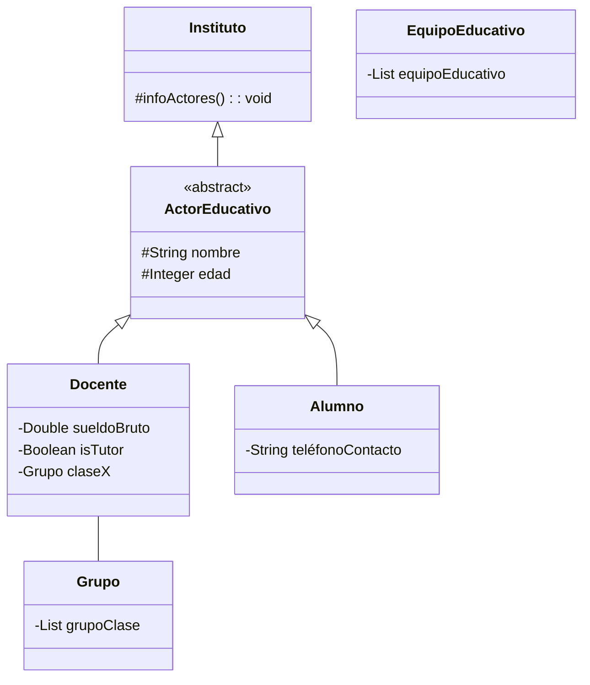

```mermaid
    classDiagram
   


    class Instituto {
    #infoActores() : void
    }
    

    class  ActorEducativo{
        <<abstract>>
        #String nombre
        #Integer edad
    }

    class  Docente{
       -Double sueldoBruto
       -Boolean isTutor
       -Grupo claseX
    }

    class Grupo {
        -List<Alumno> grupoClase
    }

    class EquipoEducativo {
        -List<Docente> equipoEducativo
    }
    
    class  Alumno{
        -String teléfonoContacto
    }


    Instituto <|-- ActorEducativo
    ActorEducativo <|-- Docente
    ActorEducativo <|-- Alumno
    Docente -- Grupo

    %% Mirar las realaciones entre docente y tutor, tutor es una entidad que hereda de docente, estableciendo
    %% una relación con docente N M lo que crea una tabla intermedia que es el equipodocente
```