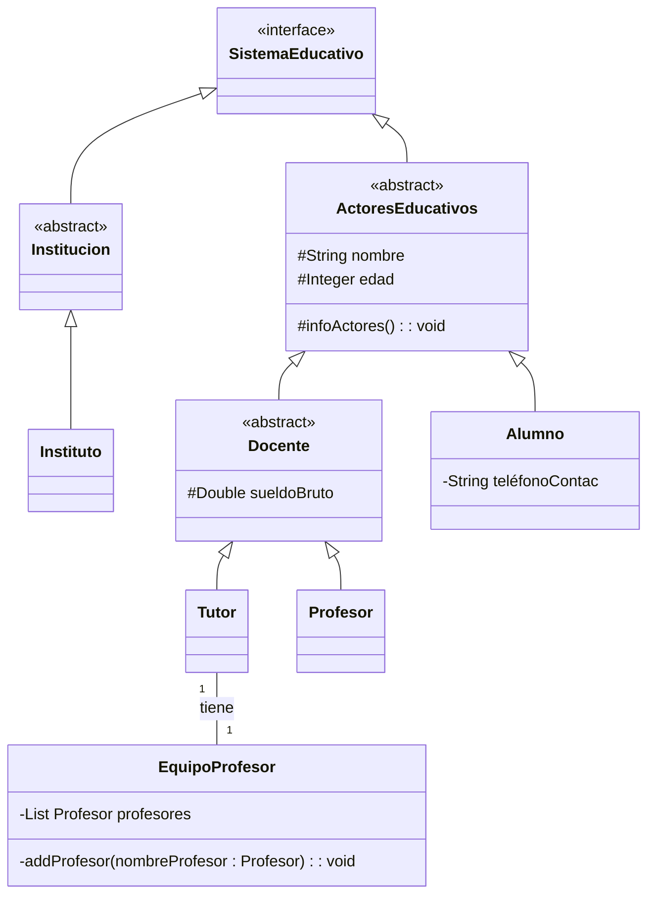

```mermaid
    classDiagram
    class SistemaEducativo {
        <<interface>>
        
    }

    class Institucion {
        <<abstract>>
        
    }
    
    class Instituto {

        
    }

    class  ActoresEducativos{
        <<abstract>>
        #String nombre
        #Integer edad
        #infoActores() : void
    }

    class  Docente{
       <<abstract>>
       #Double sueldoBruto
    }

    
    class  Tutor{
    
    }

    
    class  EquipoProfesor{
    -List Profesor profesores
    -addProfesor(nombreProfesor : Profesor) : void
    }

    
    class  Profesor{
    }

    
    class  Alumno{
        -String teléfonoContac
    }


    SistemaEducativo <|-- Institucion
    SistemaEducativo <|-- ActoresEducativos
    Institucion <|-- Instituto
    ActoresEducativos <|-- Docente
    ActoresEducativos <|-- Alumno
    Docente <|-- Tutor
    Docente <|-- Profesor
    Tutor "1" -- "1" EquipoProfesor : tiene
    
    
```