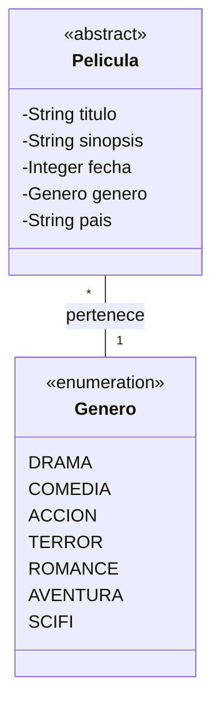

```mermaid
    classDiagram
    class Pelicula {
     <<abstract>>
    -String titulo
    -String sinopsis
    -Integer fecha
    -Genero genero
    -String pais
    }

    class Genero {
    <<enumeration>>
    DRAMA
    COMEDIA
    ACCION
    TERROR
    ROMANCE
    AVENTURA
    SCIFI
    }


    Pelicula "*" -- "1" Genero : pertenece

```

 Sobre las personas que participan en la película es necesario conocer el nombre, los apellidos, la fecha de nacimiento y nacionalidad.