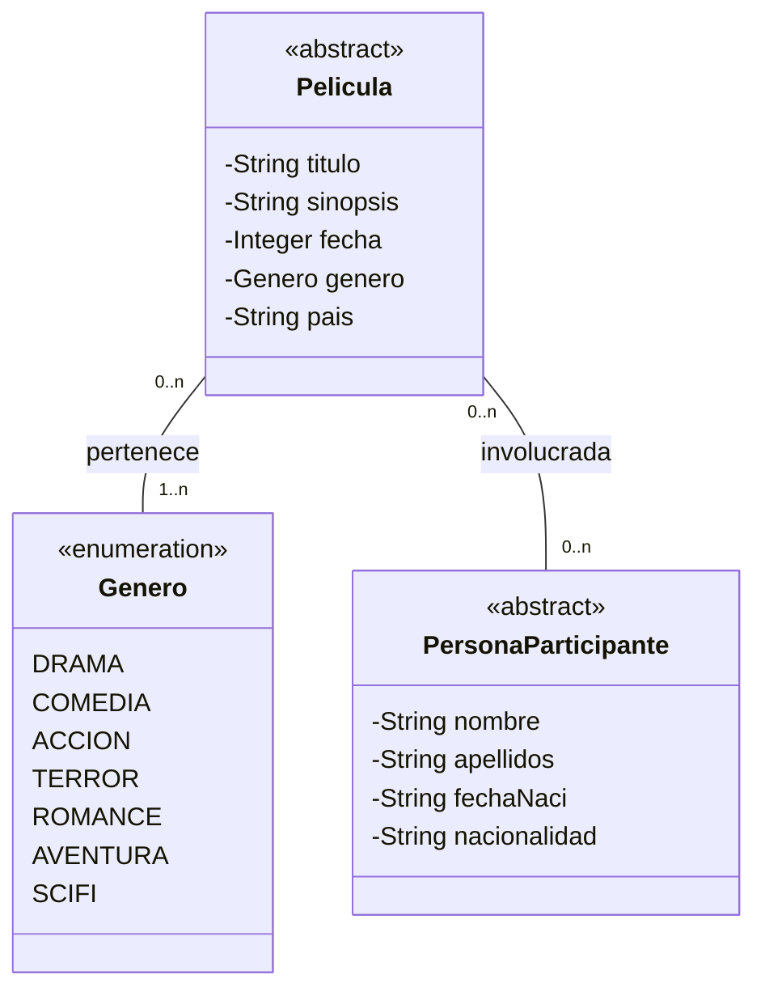

```mermaid
    classDiagram
    class Pelicula {
     <<abstract>>
    -String titulo
    -String sinopsis
    -Integer fecha
    -Genero genero
    -String pais
    }

    class Genero {
    <<enumeration>>
    DRAMA
    COMEDIA
    ACCION
    TERROR
    ROMANCE
    AVENTURA
    SCIFI
    }

    class PersonaParticipante {
        <<abstract>>
        -String nombre
        -String apellidos
        -String fechaNaci
        -String nacionalidad
    }

    Pelicula "0..n" -- "1..n" Genero : pertenece
    Pelicula "0..n" -- "0..n" PersonaParticipante : involucrada

```
