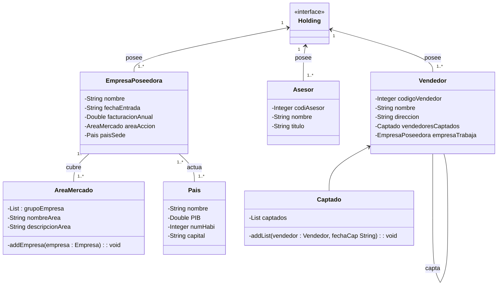

```mermaid
    classDiagram

    class Holding {
        <<interface>>
    }

    class EmpresaPoseedora {
    -String nombre
    -String fechaEntrada
    -Double facturacionAnual
    -AreaMercado areaAccion
    -Pais paisSede
    }

    class AreaMercado {
    -List <EmpresaPoseedora> : grupoEmpresa
    -String nombreArea
    -String descripcionArea

    -addEmpresa(empresa : Empresa) : void
    }
    
    class Pais {
    -String nombre
    -Double PIB
    -Integer numHabi
    -String capital
    }

    class Asesor {
    -Integer codiAsesor
    -String nombre
    -String titulo
    }

    class Vendedor {
        -Integer codigoVendedor
        -String nombre
        -String direccion
        -Captado vendedoresCaptados
        -EmpresaPoseedora empresaTrabaja
    }
    
    class Captado {
        -List<Vendedores> captados
        -addList(vendedor : Vendedor, fechaCap String) : void
    }

    Holding "1" <-- "1..*" EmpresaPoseedora : posee
    Holding "1" <-- "1..*" Vendedor : posee
    Holding "1" <-- "1..*" Asesor : posee

    EmpresaPoseedora "1..*" -- "1..*" AreaMercado : cubre
    EmpresaPoseedora "1..*" -- "1..*" Pais : actua
    Vendedor -- Vendedor : capta
    Vendedor <-- Captado
```