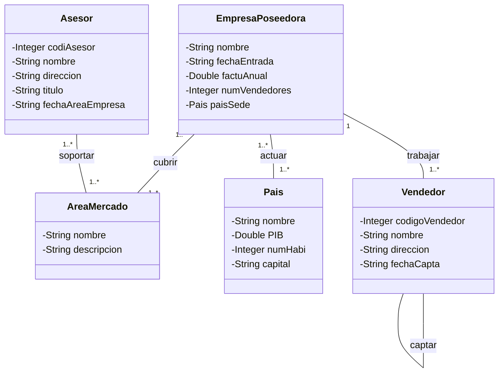

```mermaid
    classDiagram


    class EmpresaPoseedora {
        -String nombre
        -String fechaEntrada
        -Double factuAnual
        -Integer numVendedores
        -Pais paisSede
    }

    class AreaMercado {
        -String nombre
        -String descripcion
    }
    
    class Pais {
        -String nombre
        -Double PIB
        -Integer numHabi
        -String capital
    }

    class Asesor {
        -Integer codiAsesor
        -String nombre
        -String direccion
        -String titulo
        -String fechaAreaEmpresa
    }

    class Vendedor {
        -Integer codigoVendedor
        -String nombre
        -String direccion
        -String fechaCapta
    }
    

    Vendedor -- Vendedor : captar
    EmpresaPoseedora "1"-- "1..*" Vendedor : trabajar
    EmpresaPoseedora "1..*" -- "1..*" AreaMercado : cubrir
    EmpresaPoseedora "1..*" -- "1..*" Pais : actuar
    Asesor "1..*" -- "1..*" AreaMercado : soportar
    
```