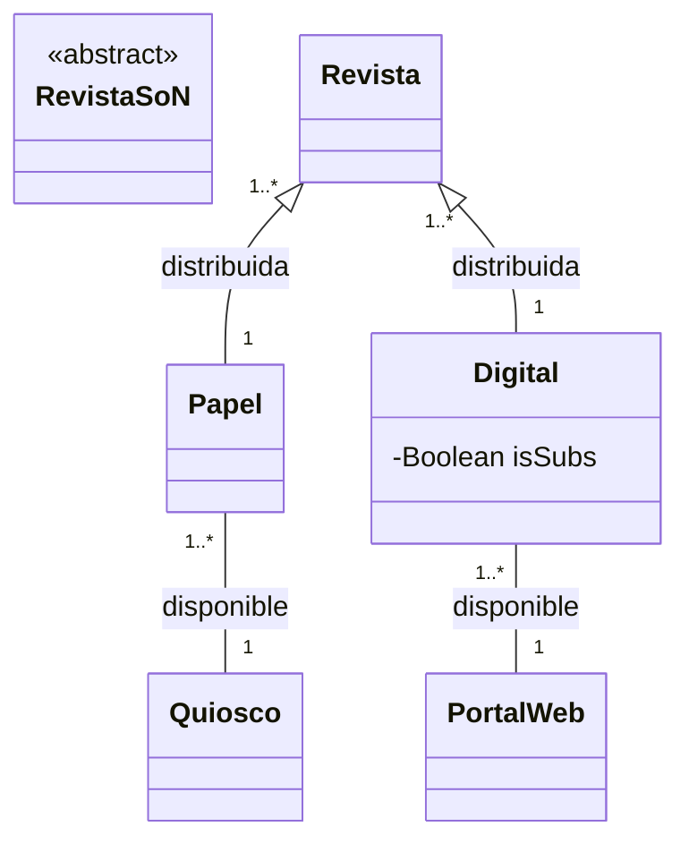

```mermaid
    classDiagram

    class RevistaSoN {
    <<abstract>>
    }

    class Papel {

    }

    class Quiosco {
    }

    class Digital {
    -Boolean isSubs
    }

    class PortalWeb {
    
    }

    Revista "1..*" <|-- "1" Papel : distribuida
    Revista "1..*" <|-- "1" Digital : distribuida
    Papel "1..*" -- "1" Quiosco : disponible
    Digital "1..*" -- "1" PortalWeb : disponible


```