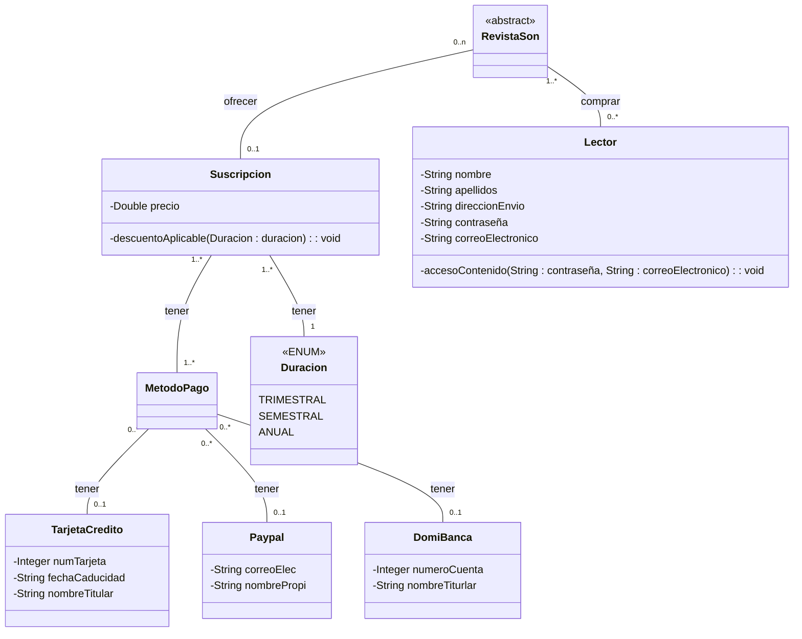

```mermaid
    classDiagram

    class RevistaSon {
    <<abstract>>
    }


    class Suscripcion {
    -Double precio
    -descuentoAplicable(Duracion : duracion) : void
    }

    class MetodoPago {
    
    }

    class TarjetaCredito{
    -Integer numTarjeta
    -String fechaCaducidad
    -String nombreTitular
    }

    class Paypal{
    -String correoElec
    -String nombrePropi
    }

    class DomiBanca{
    -Integer numeroCuenta
    -String nombreTiturlar
    }

    class Duracion {
    <<ENUM>>
    TRIMESTRAL
    SEMESTRAL
    ANUAL
    }

    class Lector {
    -String nombre
    -String apellidos
    -String direccionEnvio
    -String contraseña
    -String correoElectronico
    -accesoContenido(String : contraseña, String : correoElectronico) : void
    }


    RevistaSon "1..*" -- "0..*" Lector : comprar
    RevistaSon "0..n" -- "0..1" Suscripcion : ofrecer
    Suscripcion "1..*" -- "1" Duracion : tener
    Suscripcion "1..*" -- "1..*" MetodoPago : tener
    MetodoPago "0..*" -- "0..1" TarjetaCredito : tener
    MetodoPago "0..*" -- "0..1" Paypal : tener
    MetodoPago "0..*" -- "0..1" DomiBanca : tener

```