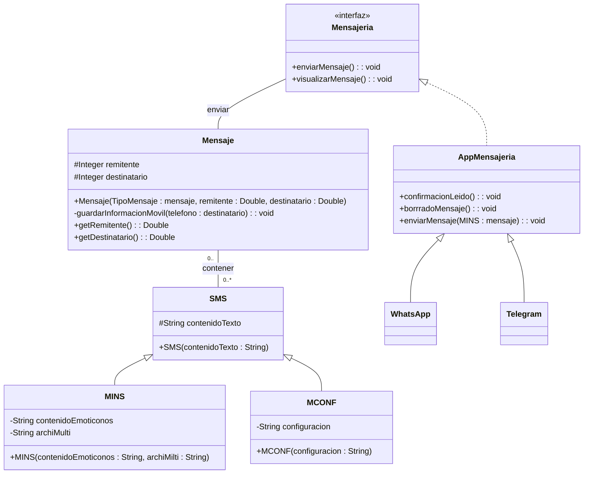

```mermaid
    classDiagram

    class Mensajeria{
    <<interfaz>>
    +enviarMensaje() : void
    +visualizarMensaje() : void
    }


    class Mensaje {
    #Integer remitente
    #Integer destinatario
    +Mensaje(TipoMensaje : mensaje, remitente : Double, destinatario : Double)
    -guardarInformacionMovil(telefono : destinatario) : void
    +getRemitente() : Double
    +getDestinatario() : Double
    }
    
    class SMS {
    #String contenidoTexto
    +SMS(contenidoTexto : String)
    }

    class MINS {
    -String contenidoEmoticonos
    -String archiMulti
    +MINS(contenidoEmoticonos : String, archiMilti : String)
    }

    class MCONF {
    -String configuracion
    +MCONF(configuracion : String)
    }


    class AppMensajeria {
    +confirmacionLeido() : void
    +borrradoMensaje() : void
    +enviarMensaje(MINS : mensaje) : void
    }
    
    
    class WhatsApp {
    
    }

    class Telegram {

    }


    Mensajeria -- Mensaje : enviar
    Mensaje "0.." -- "0..*" SMS : contener
    SMS  <|--  MINS
    SMS  <|--  MCONF
    Mensajeria <|.. AppMensajeria
    AppMensajeria <|-- WhatsApp
    AppMensajeria <|-- Telegram
```