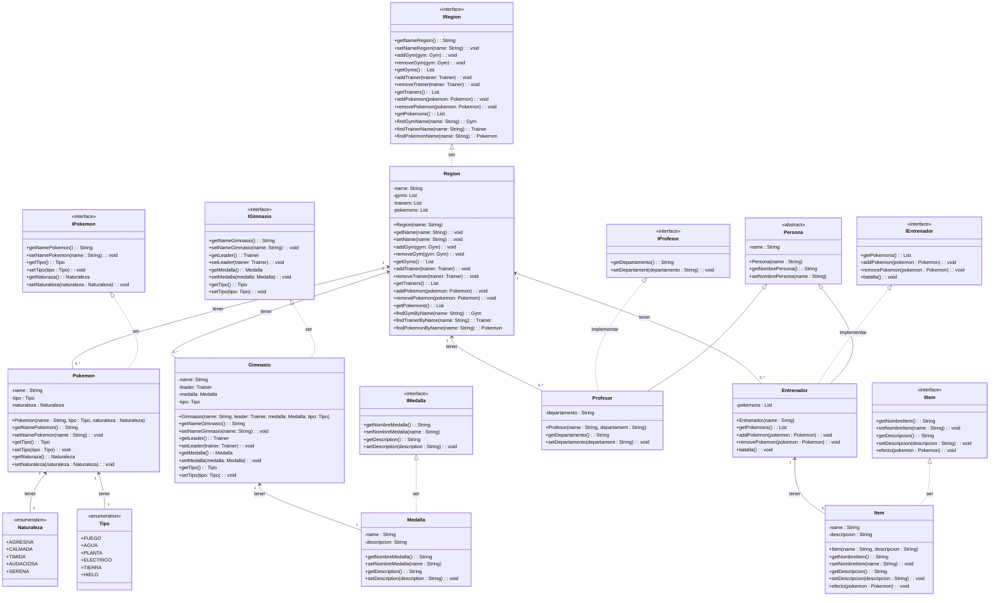

```mermaid
    classDiagram
    class IRegion {
        <<interface>>
        +getNameRegion(): String
        +setNameRegion(name: String): void
        +addGym(gym: Gym): void
        +removeGym(gym: Gym): void
        +getGyms(): List<Gym>
        +addTrainer(trainer: Trainer): void
        +removeTrainer(trainer: Trainer): void
        +getTrainers(): List<Trainer>
        +addPokemon(pokemon: Pokemon): void
        +removePokemon(pokemon: Pokemon): void
        +getPokemons(): List<Pokemon>
        +findGymName(name: String): Gym
        +findTrainerName(name: String): Trainer
        +findPokemonName(name: String): Pokemon
    }

    class Region {
        -name: String
        -gyms: List<Gym>
        -trainers: List<Trainer>
        -pokemons: List<Pokemon>
        +Region(name: String)
        +getName(name: String): void
        +setName(name: String): void
        +addGym(gym: Gym): void
        +removeGym(gym: Gym): void
        +getGyms(): List<Gym>
        +addTrainer(trainer: Trainer): void
        +removeTrainer(trainer: Trainer): void
        +getTrainers(): List<Trainer>
        +addPokemon(pokemon: Pokemon): void
        +removePokemon(pokemon: Pokemon): void
        +getPokemons(): List<Pokemon>
        +findGymByName(name: String): Gym
        +findTrainerByName(name: String): Trainer
        +findPokemonByName(name: String): Pokemon
    }

    class IGimnasio {
        <<interface>>
        +getNameGimnasio(): String
        +setNameGimnasio(name: String): void
        +getLeader(): Trainer
        +setLeader(trainer: Trainer): void
        +getMedalla(): Medalla
        +setMedalla(medalla: Medalla): void
        +getTipo(): Tipo
        +setTipo(tipo: Tipo): void
    }

    class Gimnasio {
        -name: String
        -leader: Trainer
        -medalla: Medalla
        -tipo: Tipo
        +Gimnasio(name: String, leader: Trainer, medalla: Medalla, tipo: Tipo)
        +getNameGimnasio(): String
        +setNameGimnasio(name: String): void
        +getLeader(): Trainer
        +setLeader(trainer: Trainer): void
        +getMedalla(): Medalla
        +setMedalla(medalla: Medalla): void
        +getTipo(): Tipo
        +setTipo(tipo: Tipo): void
    }
    
    class IPokemon {
        <<interface>>
        +getNamePokemon() : String  
        +setNamePokemon(name : String) : void
        +getTipo() : Tipo
        +setTipo(tipo : Tipo) : void
        +getNaturaza() : Naturaleza
        +setNaturaleza(naturaleza : Naturaleza) : void
    }

    class Pokemon {
        -name : String
        -tipo : Tipo
        -naturaleza : Naturaleza
        +Pokemon(name : String, tipo : Tipo, naturaleza : Naturaleza)
        +getNamePokemon() : String
        +setNamePokemon(name : String) : void
        +getTipo() : Tipo
        +setTipo(tipo : Tipo) : void
        +getNaturaza() : Naturaleza
        +setNaturaleza(naturaleza : Naturaleza) : void
    }

    class Persona {
        <<abstract>>
        -name : String
        +Persona(name : String)
        +getNombrePersona() : String
        +setNombrePersona(name : String)
    }

    class IEntrenador {
        <<interface>>
        +getPokemons() : List<Pokemon>
        +addPokemon(pokemon : Pokemon) : void
        +removePokemon(pokemon : Pokemon) : void
        +batalla() : void
    }

    class Entrenador {
        -pokemons : List<Pokemon>
        +Entranador(name : Sring)
        +getPokemons() : List<Pokemon>
        +addPokemon(pokemon : Pokemon) : void
        +removePokemon(pokemon : Pokemon) : void
        +batalla() : void
    }

    class IProfesor {
        <<interface>>
        +getDepartamento() : String
        +setDepartament(departamento : String) : void
    }

    class Profesor {
        -departamento : String
        +Profesor(name : String, departament : String)
        +getDepartamento() : String
        +setDepartamento(departament : String) : void
    }

    class Naturaleza {
        <<enumeration>>
        +AGRESIVA
        +CALMADA
        +TIMIDA
        +AUDACIOSA
        +SERENA
    }

    class Tipo {
        <<enumeration>>
        +FUEGO
        +AGUA
        +PLANTA
        +ELECTRICO
        +TIERRA
        +HIELO
    }

    class IItem {
        <<interface>>
        +getNombreItem() : String
        +setNombreItem(name : String) : void
        +getDescripcion() : String
        +setDescripcion(descripcion : String) : void
        +efecto(pokemon : Pokemon) : void
    }

    class Item {
        -name : String
        -descripcion : String
        +Item(name : String, descripcion : String)
        +getNombreItem() : String
        +setNombreItem(name : String) : void
        +getDescripcion() : String
        +setDescripcion(descripcion : String) : void
        +efecto(pokemon : Pokemon) : void
    }

    class IMedalla {
        <<interface>>
        +getNombreMedalla() : String
        +setNombreMedalla(name : String)
        +getDescription() : String
        +setDescription(description : String) : void
    }
    
    class Medalla {
        -name : String
        -descripcion: String
        +getNombreMedalla() : String
        +setNombreMedalla(name : String)
        +getDescription() : String
        +setDescription(description : String) : void
    }

%% Relaciones entre interfaces y clases
    IRegion <|.. Region : ser
    IGimnasio <|.. Gimnasio : ser
    IPokemon <|.. Pokemon : ser
    IItem <|.. Item : ser
    IMedalla <|.. Medalla : ser

%% Relaciones de herencia e implementación para Persona
    Persona <|-- Profesor
    IProfesor <|.. Profesor : implementar
    Persona <|-- Entrenador
    IEntrenador <|.. Entrenador : implementar

%% Relaciones de composición/asociación con cardinalidades
    Region "1" <-- "0..*" Gimnasio : tener
    Region "1" <-- "0..*" Pokemon : tener
    Region "1" <-- "0..*" Profesor : tener
    Region "1" <-- "0..*" Entrenador : tener
    Gimnasio "1" <-- "1" Medalla : tener
    Pokemon "1" <-- "1" Naturaleza : tener
    Pokemon "1" <-- "1" Tipo : tener
    Entrenador "1" <-- "0..*" Item : tener

```