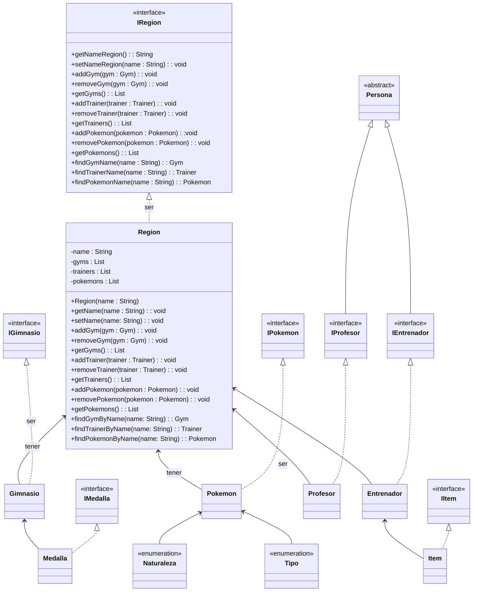

```mermaid
    classDiagram
    class IRegion {
        <<interface>>
        +getNameRegion() : String
        +setNameRegion(name : String) : void
        +addGym(gym : Gym) : void
        +removeGym(gym : Gym) : void
        +getGyms() : List<Gym>
        +addTrainer(trainer : Trainer) : void
        +removeTrainer(trainer : Trainer) : void
        +getTrainers() : List<Trainer>
        +addPokemon(pokemon : Pokemon) :void
        +removePokemon(pokemon : Pokemon) : void
        +getPokemons() : List<Pokemon>
        +findGymName(name : String) : Gym
        +findTrainerName(name : String) : Trainer
        +findPokemonName(name : String) : Pokemon
    }
    
    class Region {
        -name : String
        -gyms : List<Gym>
        -trainers : List<Trainer>
        -pokemons : List<Pokemon>
        +Region(name : String)
        +getName(name : String) : void
        +setName(name: String) : void
        +addGym(gym : Gym) : void
        +removeGym(gym : Gym) : void
        +getGyms() : List<Gym>
        +addTrainer(trainer : Trainer) : void
        +removeTrainer(trainer : Trainer) : void
        +getTrainers() : List<Trainer>
        +addPokemon(pokemon : Pokemon) : void
        +removePokemon(pokemon : Pokemon) : void
        +getPokemons() : List<Pokemon>
        +findGymByName(name: String) : Gym
        +findTrainerByName(name: String) : Trainer
        +findPokemonByName(name: String) : Pokemon
        
    }

    class IGimnasio {
        <<interface>>
    }
    
    class Gimnasio {
        
    }

    class IPokemon {
        <<interface>>
    }
    
    class Pokemon {
        
    }
    
    class Persona {
        <<abstract>>
    }

    class IEntrenador {
        <<interface>>
    }
    
    class Entrenador {
        
    }

    class IProfesor {
        <<interface>>
    }
    
    class Profesor {
        
    }

    class Naturaleza {
        <<enumeration>>
    }
    
    class Tipo {
        <<enumeration>>
    }

    class IItem {
        <<interface>>
    }

    class Item {
    }
    
    class IMedalla {
        <<interface>>
    }
    
    
    IRegion <|.. Region : ser
    Region <-- Gimnasio : tener
    Region <-- Pokemon : tener
    Region <-- Profesor
    Region <-- Entrenador

    IGimnasio <|.. Gimnasio : ser
    Gimnasio <-- Medalla

    IPokemon <|.. Pokemon : ser
    Pokemon <-- Naturaleza
    Pokemon <-- Tipo

    Persona <|-- IProfesor
    IProfesor <|.. Profesor

    Persona <|-- IEntrenador
    IEntrenador <|.. Entrenador
    Entrenador <-- Item
    IItem <|.. Item

    IMedalla <|.. Medalla

```