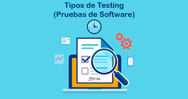

# 🧪 Diseño de Pruebas de Software 🔥



> "El código sin pruebas es solo una suposición" - Un desarrollador con experiencia 👀


---

## 🏗️ 1. Planificación de las Pruebas:

### 🎯 ¿Por qué son necesarias?

✅ **Mitigación de riesgos**: Detectar errores en etapas tempranas evita fallos críticos en producción.  
✅ **Asegurar calidad**: Garantiza que el software cumple con los requisitos funcionales y no funcionales.  
✅ **Optimización de costes**: Corregir un error en producción cuesta hasta **100 veces más** que hacerlo en desarrollo.  
✅ **Experiencia del usuario**: Un software robusto y libre de fallos genera confianza y satisfacción.  

### 🛠️ ¿Cómo se organizan?

1️⃣ **Definir objetivos** → ¿Qué queremos probar? (Funcionalidad, rendimiento, seguridad, etc.)  
2️⃣ **Seleccionar estrategias** → Caja negra, caja blanca, regresión, pruebas automatizadas.  
3️⃣ **Asignar recursos** → Herramientas, equipo, tiempo y presupuesto.  
4️⃣ **Diseñar casos de prueba** → Definir entradas, pasos y resultados esperados.  
5️⃣ **Ejecutar pruebas** → Registrar hallazgos, generar reportes y documentar errores.  
6️⃣ **Analizar y corregir** → Refinar el código, iterar y volver a probar.  

---

## 🔍 2. Tipos de Pruebas: Diseccionando el Software 🩺

```ascii
  _______     _______     _______     _______     _______     _______
 |       |   |       |   |       |   |       |   |       |   |       |
 | Negra | → | Carga | → | Estrés| → | Estab.| → | Regr. | → | Func. |
 |_______|   |_______|   |_______|   |_______|   |_______|   |_______|

  _______
 |       |
 |Blanca |
 |_______|
```

### 🖤 Caja Negra (Pruebas Funcionales)
- Evalúa la aplicación desde el **punto de vista del usuario** sin conocer el código interno.
- Se validan entradas y salidas esperadas.
- **Ejemplo**: Probar un formulario de login con credenciales incorrectas y verificar mensajes de error.

### 🤍 Caja Blanca (Pruebas Estructurales)
- Analiza el **código fuente** y su lógica interna.
- Revisa estructuras de control, validaciones y recorridos de flujo.
- **Ejemplo**: Evaluar la ejecución de todas las condiciones de un `if-else`.

### 🚀 Pruebas de Carga
- Determina cómo **responde** el software con múltiples usuarios simultáneos.
- **Ejemplo**: Simular 10,000 conexiones concurrentes a una API.

### 🔥 Pruebas de Estrés
- Lleva al sistema al **límite** para evaluar su punto de quiebre.
- **Ejemplo**: Simular 1,000,000 de peticiones en segundos.

### ⚖️ Pruebas de Estabilidad
- Se ejecuta el software por largos periodos para verificar su **consistencia**.
- **Ejemplo**: Monitorear consumo de memoria de una app durante una semana.

### ♻️ Pruebas de Regresión
- Evalúa si **nuevas actualizaciones** han roto funcionalidades existentes.
- **Ejemplo**: Después de actualizar un módulo de pagos, volver a probar todas sus funciones anteriores.

---

## 📝 3. Procedimientos y Casos de Prueba: De la Teoría a la Práctica 

Proceso estructurado que busca garantizar la calidad del software antes de su implementación.

### ☑️ Diseño de casos de prueba
Escenarios específicos diseñados para validar funcionalidades del software. Se crean a partir de los requisitos del sistema, considerando tanto los casos de uso normales como las posibles excepciones.

##### ⚠️ Deben incluir:

- Identificador único: Para su trazabilidad.
- Descripción del caso: Explicación clara de lo que se va a probar.
- Datos de entrada: Valores específicos que el usuario o el sistema deben ingresar.
- Pasos a seguir: Acciones detalladas para ejecutar la prueba.
- Resultado esperado: Qué debe ocurrir si la funcionalidad es correcta.
- Resultado obtenido: Lo que realmente ocurre tras la prueba.


### ☑️ Diseño de procedimientos de prueba
Organizan la ejecución de los casos de prueba en un flujo lógico y eficiente.

##### ⚠️ Deben incluir:

- Definición del entorno de pruebas: Se establecen los requisitos del sistema, software y hardware necesarios para la ejecución.
- Selección y orden de los casos de prueba: Se priorizan los casos de prueba según su impacto en el software.
- Ejecución y documentación: Se sigue el plan establecido y se registran los resultados para futuras referencias.
- Análisis de resultados: Se comparan los resultados obtenidos con los esperados y se identifican defectos o errores.
- Revisión y mantenimiento: Los casos de prueba se ajustan conforme evoluciona el software o se detectan mejoras en la metodología.


### ☑️ Diseño de procedimientos de prueba

- Pruebas unitarias: Se centran en pequeños fragmentos de código, como funciones o métodos.
- Pruebas de integración: Evalúan la interacción entre módulos o sistemas.
- Pruebas funcionales: Verifican que el software cumple con los requisitos especificados.
- Pruebas de rendimiento: Analizan la respuesta del sistema bajo diferentes condiciones de carga.
- Pruebas de regresión: Aseguran que los cambios o correcciones no afecten funcionalidades existentes.
  


✅ **Consejo**: Automatiza pruebas repetitivas con herramientas como **Selenium**, **Cypress** o **JUnit**.

---

## 🛠️ 4. Herramientas de Depuración

### ¿Qué son?
- **Definición**: Funcionalidades integradas en los IDEs para supervisar la ejecución de programas y detectar errores. 🖥️

### ¿Cómo ayudan a detectar errores?
- **Funcionalidades clave**:
    - 🛑 **Puntos de ruptura**: Pausan la ejecución en puntos específicos.
    - 👣 **Ejecución paso a paso**: Permite analizar el código línea por línea.
    - 🔍 **Inspección de variables**: Muestra los valores de las variables en tiempo real.
    - 🧮 **Evaluación de expresiones**: Comprueba el resultado de expresiones o condiciones lógicas.

- **Tipos de errores detectados**:
    - 🚨 **Errores de compilación**: Detectados automáticamente por el IDE.
    - 🐞 **Errores lógicos (bugs)**: Identificados mediante análisis del flujo del programa y valores de variables.

---

## ✅ 5. Validaciones

### Importancia del cliente en la evaluación del software
- **Rol del cliente**:
    - 🎯 **Decisión final**: El cliente decide si el software cumple con los requisitos.
    - 👀 **Detección de problemas**: Identifica errores de usabilidad y funcionalidad que los desarrolladores pueden pasar por alto.
    - 🔄 **Retroalimentación**: Proporciona comentarios para ajustes y mejoras antes de la entrega final.

- **Proceso de validación**:
    - 🧪 **Pruebas de cala media**: Demuestran la conformidad con los requisitos.
    - 📋 **Plan y procedimiento de pruebas**: Aseguran que se cumplen todos los requisitos funcionales, de rendimiento, documentación, etc.

---

## 📜 6. Normas de Calidad

### Principales estándares utilizados en la industria
- **BSI (British Standards Institution)**:
    - 📖 **BS 7925-1**: Vocabulario para pruebas de software.
    - 📖 **BS 7925-2**: Pruebas de componentes de software.

- **IEEE (Institute of Electrical and Electronics Engineers)**:
    - 📄 **IEEE 829**: Documentación de pruebas de software.
    - 📄 **IEEE 1008**: Pruebas de unidad.

- **ISO/IEC 29119**:
    - 🌍 **Norma unificadora**: Cubre vocabulario, procesos, documentación y técnicas para todo el ciclo de vida del software.
    - 🛠️ **Aplicación**: Utilizada en cualquier proyecto de desarrollo o mantenimiento de software.

### Importancia de las normas
- 🏗️ **Estandarización**: Proporcionan un marco común para asegurar la calidad y consistencia del software.
- 📊 **Cobertura completa**: Desde la planificación hasta la ejecución y reporte de pruebas.


