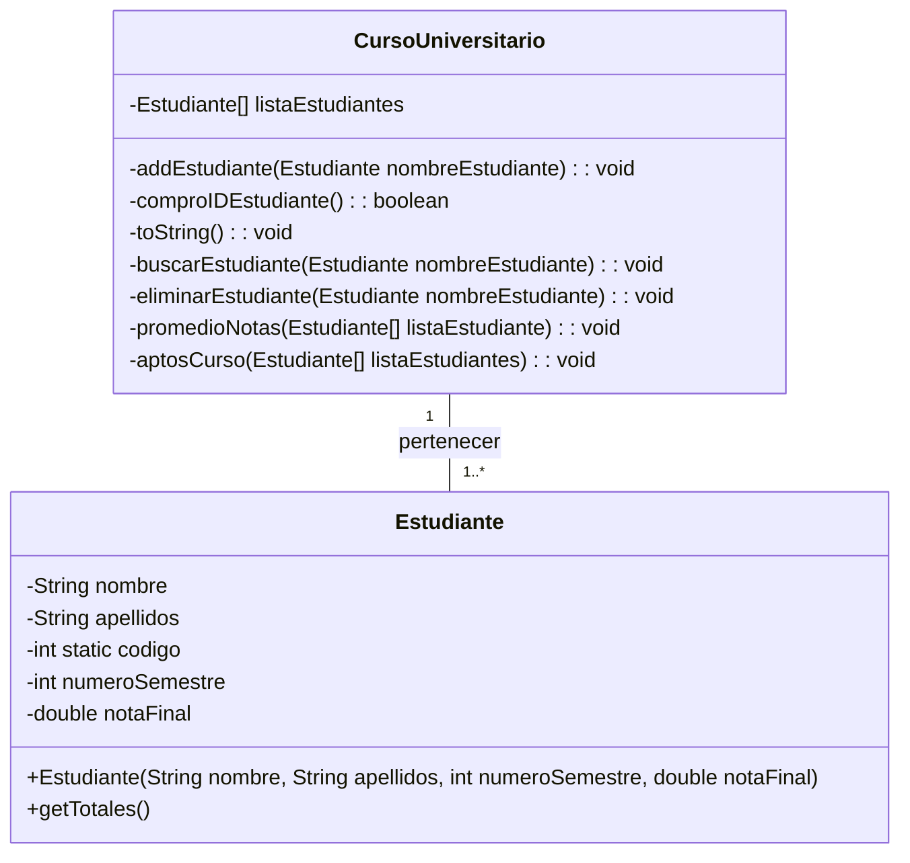

```mermaid
    classDiagram

    class CursoUniversitario {
    -Estudiante[] listaEstudiantes

    -addEstudiante(Estudiante nombreEstudiante) : void
    -comproIDEstudiante() : boolean
    -toString() : void
    -buscarEstudiante(Estudiante nombreEstudiante) : void
    -eliminarEstudiante(Estudiante nombreEstudiante) : void
    -promedioNotas(Estudiante[] listaEstudiante) : void
    -aptosCurso(Estudiante[] listaEstudiantes) : void

    }

    class Estudiante {
    -String nombre
    -String apellidos
    -int static codigo
    -int numeroSemestre 
    -double notaFinal

    +Estudiante(String nombre, String apellidos, int numeroSemestre, double notaFinal)

    +getTotales()
    }

    CursoUniversitario "1" -- "1..*" Estudiante : pertenecer

```