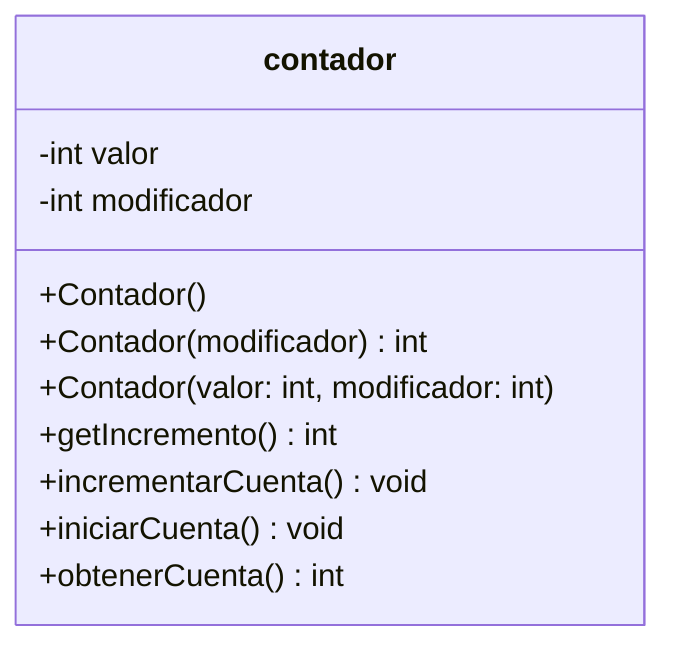

```mermaid
    classDiagram
        class contador {
            -int valor
            -int modificador

            +Contador()
            +Contador(modificador) int 
            +Contador(valor: int, modificador: int)
            +getIncremento() int
            +incrementarCuenta() void
            +iniciarCuenta() void
            +obtenerCuenta() int
    }
```